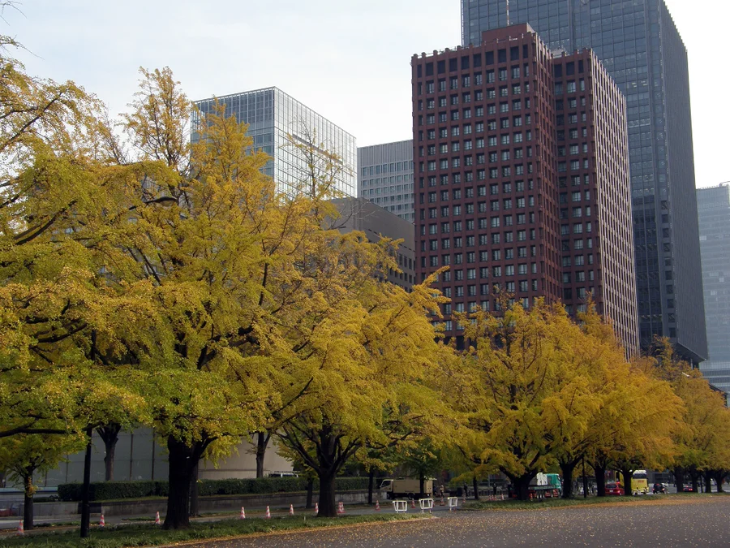
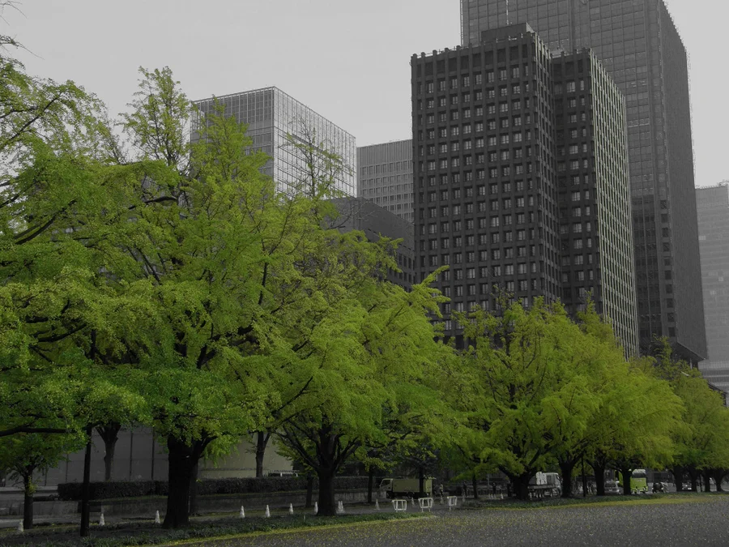
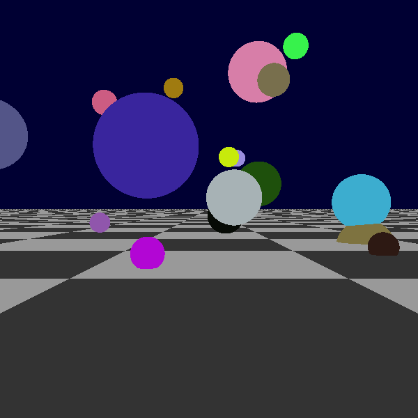
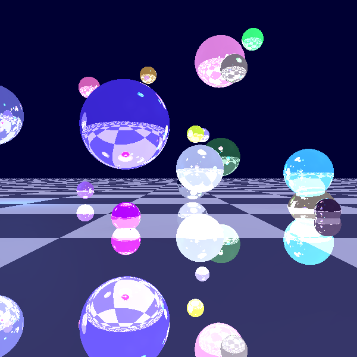
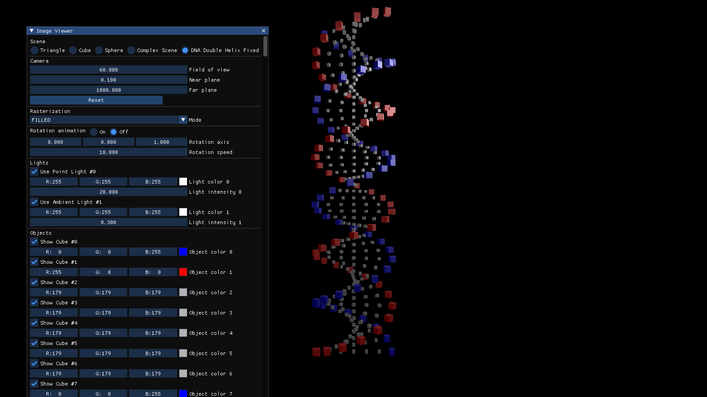
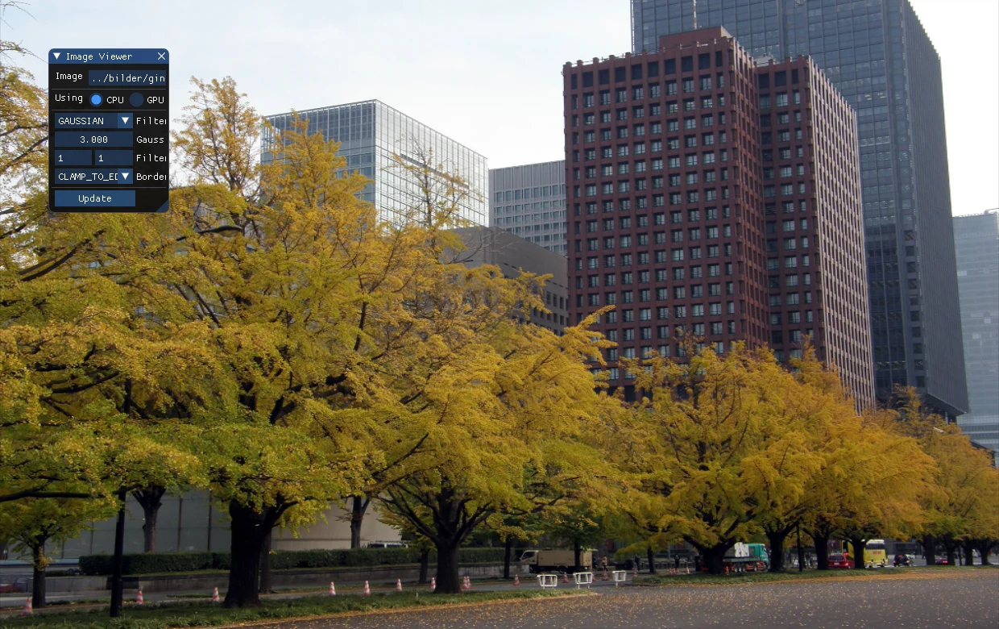
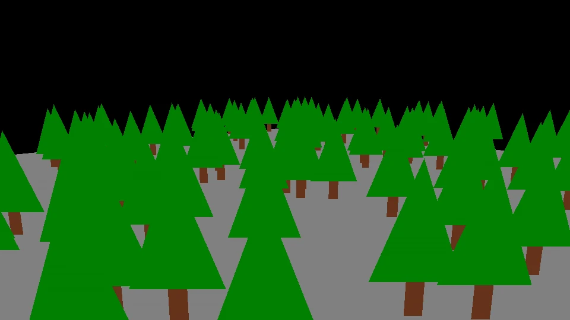
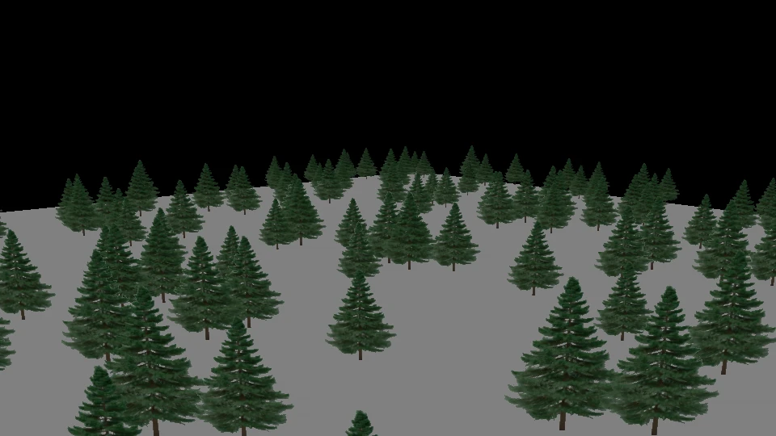
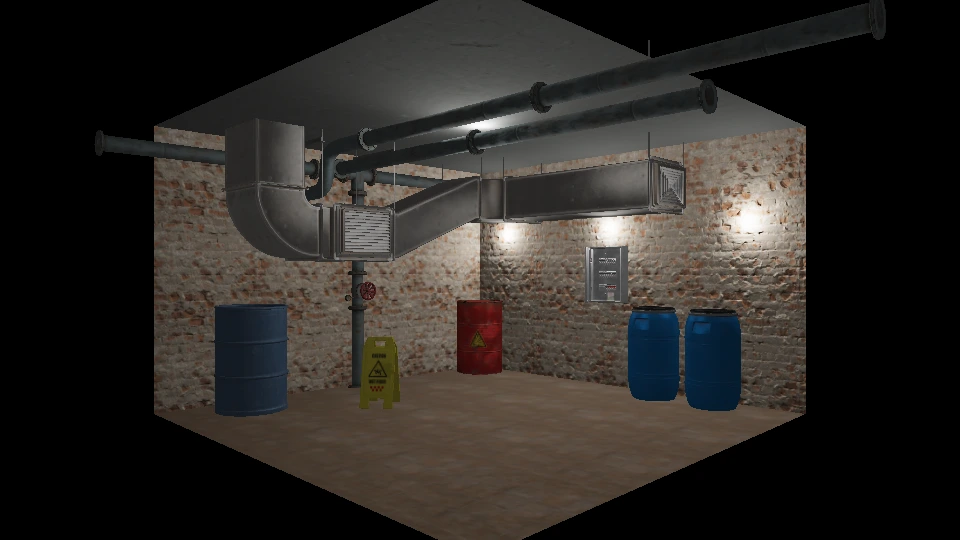

# COMPUTERGRAFIK - Assignments

[](https://github.com/daniilperkin-uni/computergraphik_aufgaben/actions/workflows/ci.yml)

This repository contains a collection of assignments for a "Computergraphik" (Computer Graphics) course. The assignments are structured to guide students through fundamental concepts and advanced techniques in computer graphics, utilizing C++ and CMake.

**Live showcase:** [uni-old-projects](https://daniilperkin-uni.github.io/uni-old-projects/#computergrafik_aufgaben) — the Blatt 04 raytracer re-renders live in the browser (a 1:1 port of the code in this repository), alongside captures of every sheet.

## Screenshots

Captures from the built assignments — the complete set, including the console-mode filter outputs, is on the live showcase.

**Blatt 02 — colour-space pipeline:** original vs colour-key effect
 

**Blatt 03 — first sphere intersections** (ctest-checked against the course reference):


**Blatt 04 — ray-traced scene** (Phong, shadows, mirror reflections):


**Blatt 06 — software rasterizer** (DNA double helix):


**Blatt 07 — image-filtering GUI** (Ginkgo photo):


**Blatt 08 — instanced geometry vs billboard imposters:**
 

**Blatt 09 — glTF scene shading** (the exercise's own glTF scene):


## Course Overview

The curriculum covers a range of topics, progressing from basic C++ programming to complex graphics implementations:
*   **Basic C++ Programming:** Foundational programming concepts are reinforced in early assignments.
*   **Image Processing:** Introduction to digital image representation, manipulation, and fundamental algorithms.
*   **Ray Tracing:** Implementation of ray tracing techniques for realistic image synthesis, including object intersection, lighting, and scene construction.
*   **Real-time Rasterization:** Development of a rasterization pipeline for interactive graphics, covering scene management, camera controls, various lighting models, and rendering of geometric primitives.

## Technologies Used

*   **Primary Language:** C++ (C++17 for every sheet)
*   **Build System:** CMake
*   **Key Libraries (especially in later assignments):**
    *   **GLFW:** Used for creating windowed environments and managing OpenGL contexts.
    *   **GLAD:** An essential OpenGL loader to access OpenGL functions.
    *   **GLM (OpenGL Mathematics):** A header-only library that provides GLSL-like types and functions for C++, crucial for 3D mathematics.
    *   **Dear ImGui:** A minimalist, bloat-free graphical user interface library for in-application debugging and tools.
    *   **glowl:** An open-source, lightweight C++ wrapper library for OpenGL objects (shader programs, textures, buffers); a subset is vendored in sheets 06 and 07.

## Project Structure and Navigation

The assignments are organized into `AufgabenblattXX` directories, where `XX` represents the assignment number (e.g., `Aufgabenblatt01`, `Aufgabenblatt02`). Each directory typically contains its own `CMakeLists.txt` and source files relevant to that assignment.

-   **`Aufgabenblatt01/`**: Introduction to C++ fundamentals and basic programming tasks.
-   **`Aufgabenblatt02/`**: Focus on image processing and manipulation.
-   **`Aufgabenblatt03/`**: Introduction to ray generation and object intersection, forming the basis of ray tracing.
-   **`Aufgabenblatt04/`**: Advanced Ray Tracing features including point lights and shadows.
-   **`Aufgabenblatt05/`**: Written solutions to the 2D/3D transformation exercises (`Aufgabenblatt05.pdf`); no code was submitted for this sheet, so it has no CMake project.
-   **`Aufgabenblatt06/`**: Advanced topics covering rasterization, scene graphs, lighting, and interactive rendering using OpenGL-related libraries.
-   **`Aufgabenblatt07/`**: Image processing on CPU, featuring convolution filters (Gaussian, Laplacian) and boundary handling.
-   **`Aufgabenblatt08/`**: Efficient rendering of large scenes using Instanced Rendering and Billboards (Imposters), utilizing Direct State Access (DSA).
-   **`Aufgabenblatt09/`**: Scene Shading, covering scene graphs, vertex data management, Phong lighting, and Normal Mapping.

Each `AufgabenblattXX` folder contains a dedicated `README.md` with a more detailed description of the specific tasks and context for that assignment.

## Prerequisites

*   **C++ compiler** supporting **C++17** (e.g., g++ >= 8, clang++ >= 7, or MSVC 2019+).
*   **CMake >= 3.16**.
*   **OpenGL 4.4+** (4.5+ recommended) for the real-time assignments (`Aufgabenblatt06`-`Aufgabenblatt09`). GLFW 3.4, GLM 1.0.1, Dear ImGui and tinygltf are downloaded automatically by CMake (FetchContent); GLAD and glowl are vendored. On Linux install the OpenGL/X11 headers: `sudo apt-get install libgl1-mesa-dev libxrandr-dev libxinerama-dev libxcursor-dev libxi-dev`.
*   The early ray-tracing assignments (`Aufgabenblatt03`, `Aufgabenblatt04`) have **no external dependencies** beyond a C++17 compiler and CMake.

## Building and Running Assignments

There are two supported ways to build.

### Option A - Build everything from the repository root

A root `CMakeLists.txt` is provided that wires up every assignment sheet that ships its own `CMakeLists.txt` via `add_subdirectory()` (guarded by `EXISTS` checks, so missing sheets are skipped). From the repository root:

```bash
cmake -B build
cmake --build build
```

> Note: `Aufgabenblatt03` and `Aufgabenblatt04` build targets are named `Raytracer03` and `Raytracer04` (they originally both produced a `Raytracer` target). Sheet 07's target is `ImageViewer07` so it coexists with sheet 06's `ImageViewer`.

### Option B - Build a single sheet (per-sheet)

Each assignment sheet has its own `CMakeLists.txt` and can be built independently. This is the recommended approach when you only work on one sheet or when a sheet needs OpenGL dependencies that are not available globally.

For the ray tracer sheets (no OpenGL deps), e.g. `Aufgabenblatt03`:

```bash
cmake -S Aufgabenblatt03/code -B Aufgabenblatt03/code/build
cmake --build Aufgabenblatt03/code/build --parallel
```

For an OpenGL sheet, e.g. `Aufgabenblatt06`:

```bash
cmake -S Aufgabenblatt06/00_student_setup/code -B Aufgabenblatt06/00_student_setup/code/build
cmake --build Aufgabenblatt06/00_student_setup/code/build --parallel
```

**Running Executables**

After a successful build, the executable files will be located in the build directory (often within a `Debug` or `Release` subfolder, depending on the generator).

Run the Blatt 03 ray tracer:

```bash
# Linux/macOS
./Aufgabenblatt03/code/build/Raytracer03

# Windows
.\Aufgabenblatt03\code\build\Raytracer03.exe
```

Run the `ImageViewer` from `Aufgabenblatt06`:

```bash
# Linux/macOS
./Aufgabenblatt06/00_student_setup/code/build/ImageViewer

# Windows
.\Aufgabenblatt06\00_student_setup\code\build\ImageViewer.exe
```
Run `ImageViewer07` from `Aufgabenblatt07` either interactively (no arguments) or in console mode with a source and target image (the image I/O reads PBM/PGM/PPM only, there is no PNG/JPEG decoder):

```bash
cd Aufgabenblatt07/00_student_setup/code
./build/ImageViewer07 bilder/<input>.ppm out.ppm
```

The OpenGL viewers load their shaders and images via relative paths, so where you start
them from matters: `Aufgabenblatt08` and `Aufgabenblatt09` hardcode `../shaders/...`,
so they only work when started from their `code/build` directory. `ImageViewer`
(Blatt 06) tries several path prefixes and also works from the sheet's `code`
directory, while `ImageViewer07` (Blatt 07) only finds its default image when started
from `code/build` and otherwise asks you to open one.

**Verifying the Blatt 03 ray tracer against its reference images**

`Aufgabenblatt03` renders one image and compares it with
`code/reference_rayGeneration.ppm` or `code/reference_sphereIntersection.ppm`,
depending on the `TEST_RAY_GENERATION` / `TEST_SPHERE_INTERSECT` flags in its
`main.cpp`. It now exits with a non-zero status when the comparison reports more
than 0.1% different pixels, which is wired up as a ctest test and therefore also
runs in CI:

```bash
cd Aufgabenblatt03/code/build
ctest --output-on-failure
```

**Scene asset for `Aufgabenblatt09`**

`SceneShading` renders a glTF scene from `scene.glb`. That binary asset is **not**
part of this repository - no `.glb` file is committed anywhere - so you have to
place the scene that belongs to the Blatt 09 exercise yourself. The program
reports the path it tried and aborts if the file is missing, instead of opening a
window with an empty scene.

Option 1: put the asset where the sheet expects it (a `scene_file` folder next to
`code/`, matching the default `../../scene_file/resources/scene.glb` when the
viewer runs from `code/build`):

```
Aufgabenblatt09/
├── code/
└── scene_file/
    └── resources/
        └── scene.glb
```

Option 2: pass the location as the first command line argument:

```bash
cd Aufgabenblatt09/code/build
./SceneShading /path/to/scene.glb
```

*(The exact path and executable name will vary depending on the specific assignment and your operating system.)*

## Development Conventions

*   **Language Standard:** Modern C++ features are used, all sheets compile as C++17.
*   **Memory Management:** `std::shared_ptr` is commonly employed for robust object management within scene graphs and object hierarchies, promoting safer memory handling.
*   **Code Structure:** Code is logically organized into modules. The image/rasterizer code of sheets 02, 06 and 07 lives in `namespace cg`; the ray tracers (03/04) and sheets 08/09 use the global namespace.
*   **Documentation:** Code includes comments (some in German) explaining complex logic and `TODO` markers indicating areas for student implementation.

---
*This `README.md` was generated by a Gemini-powered AI agent to provide a comprehensive overview of the project.*